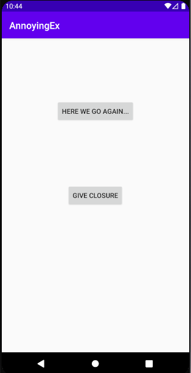

# AnnoyingEx

The app you’re building for this assignment is called, “The Annoying Ex”, where every hour, the phone will
ping notifications with messages such as, “hey you up?, “wyd”, “I miss you”, “can we talk”, “i still love you”,
“plz unblock me”, “Netflix n chill?”. #howNotToSlideInTheDMs. But don’t worry, you’ll have the ability to block
them with a “Give Closure” button.

attempted extra credit 1

}
